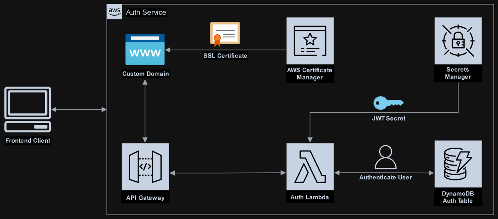

# Lambda Auth Service

Simple Auth Service running on Lambda with SecretsManager and DynamoDB

### Local Testing

`Localstack should be installed and running.`

1. Populate localstack with ./localstack/populate.sh script
2. Create test-parameters.env file from the example with your localstack url
3. Update region parameter in sam-start to the same region as in LocalStack
4. Start AWS SAM with ./sam-start script
5. run npm test or use the client from web-test folder
* Integration tests uses domain, user and password from test-variables file, which are the same as in the localstack population script.

### Deployment
1. Create stack using the AWS Console or CLI, populating the parameters.
    * AWS SAM uses already set parameters values from the stack when deploying.
2. Deploying using AWS `sam deploy` or setup a Jenkins pipeline.